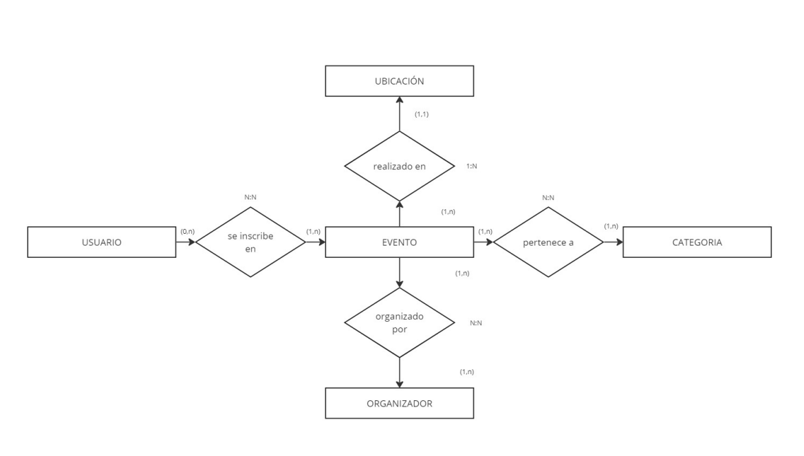

# Bases de Datos

## **Estructura de la Base de Datos**

La base de datos está compuesta por las siguientes tablas:

### 1. **USUARIO**
Almacena la información de los usuarios del sistema.
- **ID**: Identificador único autoincremental.
- **NOMBRE**: Nombre del usuario.
- **AP1**: Primer apellido del usuario.
- **AP2**: Segundo apellido del usuario.
- **CORREO**: Correo electrónico del usuario.
- **CONTRASEÑA**: Contraseña del usuario (almacenada como texto).

### 2. **TLF_USUARIO**
Almacena los números de teléfono asociados a cada usuario.
- **ID_USUARIO**: Clave foránea que referencia al ID del usuario.
- **TLF**: Número de teléfono del usuario.

### 3. **UBICACION**
Almacena las ubicaciones de los eventos.
- **ID**: Identificador único autoincremental.
- **PAIS**: País de la ubicación.
- **CIUDAD**: Ciudad de la ubicación.
- **LOCALIDAD**: Localidad de la ubicación.
- **CALLE**: Calle de la ubicación.
- **LETRA**: Letra del edificio o local (opcional).
- **CP**: Código postal de la ubicación.
- **NUMERO**: Número del edificio o local (opcional).

### 4. **CATEGORIA**
Almacena las categorías de los eventos.
- **ID**: Identificador único autoincremental.
- **NOMBRE**: Nombre de la categoría.
- **DESCRIPCION**: Descripción de la categoría.

### 5. **ORGANIZADOR**
Almacena la información de los organizadores de eventos.
- **ID**: Identificador único autoincremental.
- **RAZON_SOCIAL**: Razón social del organizador.

### 6. **TLF_ORGANIZADOR**
Almacena los números de teléfono asociados a cada organizador.
- **ID_ORGANIZADOR**: Clave foránea que referencia al ID del organizador.
- **TLF**: Número de teléfono del organizador.

### 7. **EVENTO**
Almacena la información de los eventos.
- **ID**: Identificador único autoincremental.
- **ID_UBICACION**: Clave foránea que referencia a la ubicación del evento.
- **NOMBRE**: Nombre del evento.
- **FECHA**: Fecha del evento.
- **HORA_COMIENZO**: Hora de inicio del evento.
- **DURACION**: Duración del evento en horas.
- **ESTADO**: Estado del evento (activo/inactivo).
- **MODALIDAD**: Modalidad del evento (O: Online, P: Presencial, A: Ambos).
- **TIPO**: Tipo de evento (C: Conferencia, T: Taller, A: Actividad).
- **ID_ORGANIZADOR**: Clave foránea que referencia al organizador del evento.
- **ID_CATEGORIA**: Clave foránea que referencia a la categoría del evento.

### 8. **INSCRIPCION**
Almacena las inscripciones de usuarios a eventos.
- **ID_USUARIO**: Clave foránea que referencia al ID del usuario.
- **ID_EVENTO**: Clave foránea que referencia al ID del evento.
- **FECHA_INSCRIPCION**: Fecha en la que el usuario se inscribió al evento.

---

## **Esquema Relacional**

El esquema relacional de la base de datos es el siguiente:

---

## **Diagrama Entidad-Relación (E-R)**

El diagrama E-R representa las entidades y sus relaciones en la base de datos. Las relaciones principales son:

---

## **Instrucciones para Ejecutar el Script SQL**

1. **Requisitos**:
   - Tener instalado Oracle SQL XE.
   - Tener acceso a SQL Developer.

2. **Pasos**:
   - Abre el archivo `BBDD_Indra.sql` en SQL Developer.
   - Ejecuta el script completo para crear las tablas y establecer las relaciones.
   - Verifica que las tablas se han creado correctamente y que las restricciones están aplicadas.

---

## **Documentación Adicional**

El archivo **TablasEntidades.pdf** contiene una descripción detallada de cada entidad, incluyendo los atributos, su tipo de dato, si son opcionales o no, y si son univaluados o multivaluados.

---
