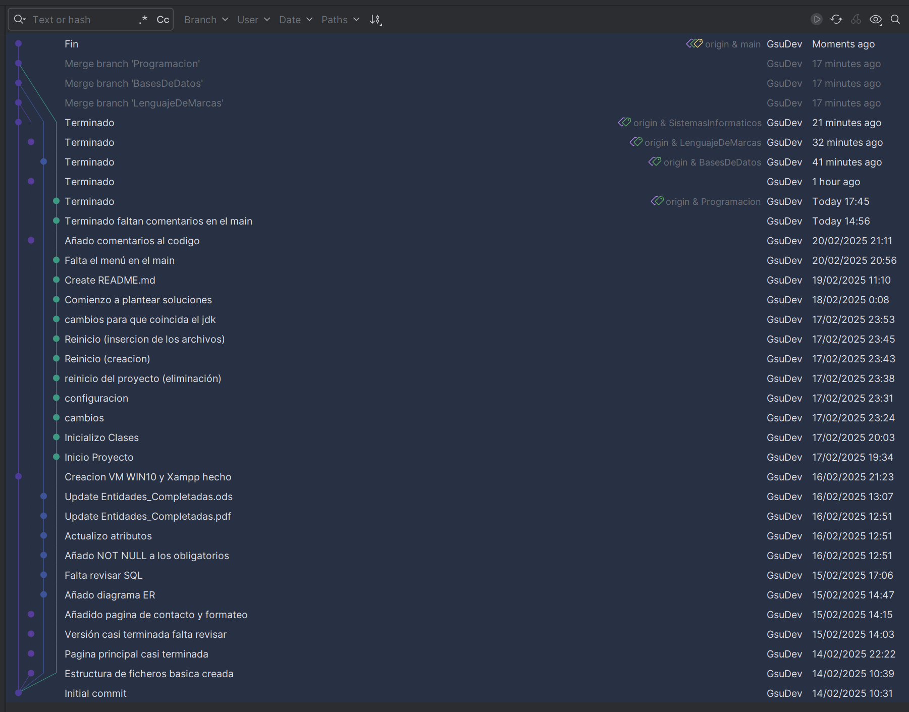

# 📌 Entornos de Desarrollo

Este documento detalla el uso de Git en el desarrollo del proyecto, incluyendo la gestión de ramas, commits y flujo de trabajo en el repositorio.

## 📂 Estructura del Repositorio

Para organizar mejor el desarrollo del proyecto, se ha utilizado una rama específica para cada asignatura, permitiendo trabajar de manera independiente en cada una sin interferencias entre ellas.

### 🔀 Gestión de Ramas

Se han creado y gestionado las siguientes ramas:

- `main` → Rama principal que contiene el código final y aprobado.
- `bases-datos` → Desarrollo y ajustes relacionados con la asignatura de Bases de Datos.
- `lenguaje-marcas` → Archivos y código relacionados con Lenguaje de Marcas.
- `programacion` → Desarrollo del código fuente en Kotlin.
- `sistemas-informaticos` → Instalación y configuración de un servidor web.
  
### 📷 Captura de las ramas



## ✅ Uso de Git en el Proyecto

Durante el desarrollo, se ha utilizado Git para el control de versiones. Algunas de las prácticas implementadas incluyen:

- **Commits frecuentes** 📌: Cada cambio relevante se ha registrado con un mensaje claro y descriptivo.
- **Uso de ramas** 🔀: Para evitar conflictos, cada asignatura ha tenido su propia rama de trabajo.
- **Merge y pull requests** 🔄: Se han fusionado cambios desde las ramas secundarias a `main` tras su revisión.
- **.gitignore** 🚫: Se han excluido archivos innecesarios para mantener el repositorio limpio.

## 🛠️ Comandos Utilizados

Algunos de los comandos más utilizados durante el desarrollo del proyecto han sido:

```bash
# Clonar el repositorio
git clone <URL_DEL_REPOSITORIO>

# Crear una nueva rama
git checkout -b nombre-rama

# Cambiar de rama
git checkout nombre-rama

# Añadir cambios al área de preparación
git add .

# Confirmar cambios
git commit -m "Mensaje descriptivo del cambio"

# Subir cambios al repositorio
git push origin nombre-rama

# Fusionar una rama a main
git merge nombre-rama
```

## 📄 Conclusión

El uso de Git ha permitido un desarrollo más organizado y seguro, asegurando que cada asignatura y funcionalidad se trabajara de manera independiente sin afectar al proyecto principal.

